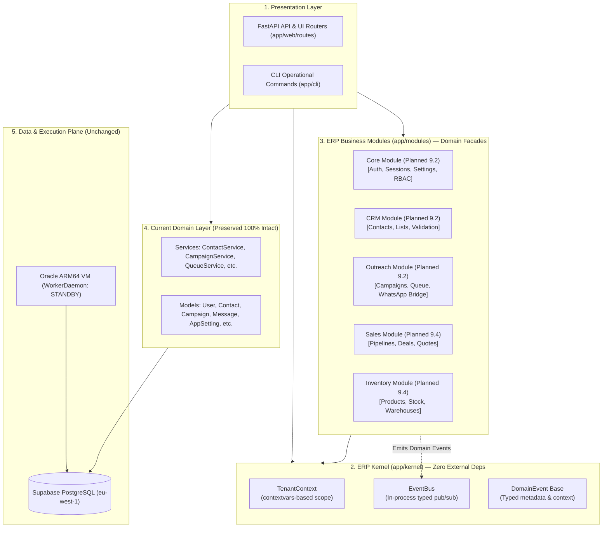
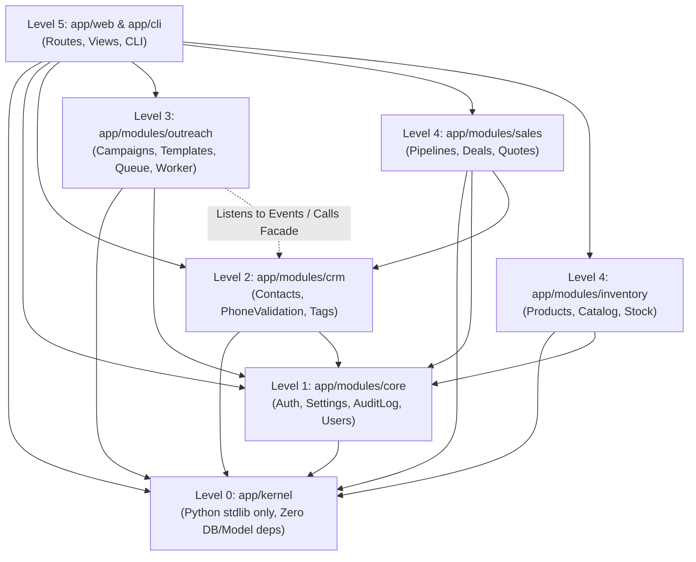

# PHASE 9.1 — KERNEL, TENANT CONTEXT & IN-PROCESS EVENT BUS
## Architectural Design Review & Implementation Specification

**Document Version:** 1.0.0  
**Phase:** Phase 9.1 (Modular ERP Kernel Foundation)  
**Status:** PROPOSED FOR OPERATOR APPROVAL — ZERO CODE MUTATIONS PERFORMED  
**Date:** October 6, 2026  
**System Baseline:** Phase 8 Step D Verified Live in Dublin (`master` @ `2f8c573`)  

---

## 1. Executive Summary

Phase 8 Step D successfully established our high-performance foundation in production:
- Colocated compute in Dublin (`dub1`) alongside Supabase PostgreSQL (`eu-west-1`), reducing database readiness latency by **73.8%** (from 1,086 ms to 284 ms).
- Deployed atomic `FOR UPDATE SKIP LOCKED` claiming backed by PostgreSQL index `idx_messages_queue_claim_pg`.
- Maintained 100% safety invariants: 7 messages intact in database, zero WhatsApp messages dispatched, 61/61 regression tests passing.

Phase 9 initiates the evolutionary transition of the system into an enterprise-grade **Modular Monolith ERP**.

In strict accordance with the **Phase 9.1 Boundaries**:
- **Zero Phase 9.2+ work** is performed.
- **Zero database migrations** or schema changes are applied (`tenant_id` columns are NOT added to production tables in Stage 9.1).
- **Zero external message brokers or distributed caching** (No Redis, Kafka, RabbitMQ, Celery, or microservices).
- **Zero modifications** to WhatsApp execution, campaigns, WorkerDaemon, or ProductionRunner.
- **Zero mutations** to production data.

Stage 9.1 designs and establishes the in-process **ERP Kernel** (`app/kernel/`), providing:
1. **Tenant Context Abstraction** (`TenantContext`) for thread-safe and async-safe request/task scoping.
2. **In-Process Domain Event Bus** (`EventBus`) for decoupled, typed pub/sub event dispatching.
3. **Formal Module Boundary Rules** for clean domain separation without circular dependencies.
4. **100% Backward Compatibility** with the existing codebase and automated test suite.

---

## 2. Architecture Map & System Topology



---

## 3. Dependency Graph & Directionality

To eliminate circular dependencies and ensure high maintainability, the module dependency hierarchy is strictly unidirectional:



### Strict Architectural Invariants:
1. **Level 0 (Kernel) is pure**: `app/kernel` MUST NOT import anything from `app/models`, `app/services`, `app/web`, or `app/database`. It depends solely on the Python standard library (`typing`, `contextvars`, `datetime`, `uuid`, `logging`).
2. **Unidirectional flow**: Modules at Level $N$ may only import from Level $< N$.
3. **No direct model cross-imports**: Module A must never import Module B's database models directly. Cross-module data sharing occurs via public facade contracts or domain events.

---

## 4. Tenant Context Specification (`app/kernel/tenant_context.py`)

### 4.1 Design Principles
- **Explicit Context**: Tenant identity is tracked explicitly via standard Python `contextvars.ContextVar`.
- **Zero Global Mutable State**: Context is strictly isolated per thread and per `asyncio` task. Concurrent web requests and background tasks cannot leak context to one another.
- **Fail-Safe Access**: Requesting tenant context when none is bound raises `MissingTenantContextError` rather than silently returning `None` or defaulting to a random tenant.
- **Canonical System Tenant**: Background daemons (WorkerDaemon, preflight health checks, queue processors) execute under a deterministic System Tenant UUID (`00000000-0000-0000-0000-000000000001`).
- **Zero Database I/O**: Creating and scoping tenant context is a pure in-memory operation ($< 1\ \mu\text{s}$).

### 4.2 Data Structures & Public API
```python
@dataclass(frozen=True)
class TenantContext:
    tenant_id: str
    name: str = "Default"
    slug: str = "default"
    is_system: bool = False
    metadata: Dict[str, Any] = field(default_factory=dict)

    SYSTEM_TENANT_ID: str = "00000000-0000-0000-0000-000000000001"

    @classmethod
    def create_system_context(cls) -> "TenantContext":
        """Returns the canonical system tenant context for background daemon execution."""
        return cls(
            tenant_id=cls.SYSTEM_TENANT_ID,
            name="System / Operator",
            slug="system",
            is_system=True
        )

    @classmethod
    def get() -> Optional["TenantContext"]:
        """Returns current active TenantContext, or None if unbound."""
        return _current_tenant_var.get(None)

    @classmethod
    def require() -> "TenantContext":
        """Returns current active TenantContext. Raises MissingTenantContextError if unbound."""
        ctx = cls.get()
        if ctx is None:
            raise MissingTenantContextError("Operation requires an active TenantContext.")
        return ctx

    @classmethod
    def get_current_tenant_id() -> str:
        """Returns the current tenant_id string. Raises MissingTenantContextError if unbound."""
        return cls.require().tenant_id

    @classmethod
    @contextmanager
    def scope(cls, context: "TenantContext") -> Iterator["TenantContext"]:
        """Context manager setting active TenantContext and guaranteeing restoration on exit."""
        token = _current_tenant_var.set(context)
        try:
            yield context
        finally:
            _current_tenant_var.reset(token)

    @classmethod
    def with_context(cls, context: "TenantContext"):
        """Decorator binding a specific TenantContext for the duration of a function call."""
        def decorator(fn):
            @wraps(fn)
            def wrapper(*args, **kwargs):
                with cls.scope(context):
                    return fn(*args, **kwargs)
            return wrapper
        return decorator
```

---

## 5. Domain Event Bus Specification (`app/kernel/event_bus.py`)

### 5.1 Design Principles
- **In-Process Only**: Zero external infrastructure. No Redis, Kafka, RabbitMQ, or Celery.
- **Typed Domain Events**: Events inherit from `DomainEvent` with immutable metadata.
- **Deterministic Priority Ordering**: Handlers execute in ascending priority order (lower number = earlier execution).
- **Exception Isolation & Aggregation**: If one handler fails, subsequent handlers still execute. All exceptions are collected in a structured `EventDispatchResult`. If any handler failed, an aggregate `EventDispatchError` is raised unless `fail_fast=False` error collection mode is requested.
- **Zero Hidden Background Threads**: Handlers execute in the calling thread (or caller's event loop). The event bus does NOT launch uncontrolled background threads.
- **Zero Database Persistence**: The event bus is a lightweight decoupling mechanism, not an event-sourcing database.

### 5.2 Event Data Structures (`app/kernel/events.py`)
```python
@dataclass(frozen=True)
class DomainEvent:
    event_id: str = field(default_factory=lambda: str(uuid.uuid4()))
    event_type: str = field(default="base.event")
    occurred_at: datetime = field(default_factory=lambda: datetime.now(timezone.utc))
    tenant_id: Optional[str] = field(default=None)
    correlation_id: Optional[str] = field(default=None)

    def __post_init__(self):
        # Automatically capture active TenantContext if tenant_id was not explicitly supplied
        if self.tenant_id is None:
            active_ctx = TenantContext.get()
            if active_ctx is not None:
                object.__setattr__(self, "tenant_id", active_ctx.tenant_id)
```

### 5.3 Public API (`app/kernel/event_bus.py`)
```python
class EventBus:
    """Thread-safe, in-process domain event bus."""

    def subscribe(self, event_cls: Type[DomainEvent], handler: Callable, priority: int = 100) -> None:
        """Subscribes a callable handler to a specific DomainEvent class with deterministic priority."""

    def unsubscribe(self, event_cls: Type[DomainEvent], handler: Callable) -> bool:
        """Removes a registered handler. Returns True if found and removed."""

    def publish(self, event: DomainEvent, fail_fast: bool = False) -> EventDispatchResult:
        """Synchronously dispatches event to all registered handlers in priority order."""

    async def publish_async(self, event: DomainEvent, fail_fast: bool = False) -> EventDispatchResult:
        """Asynchronously dispatches event, awaiting coroutine handlers where present."""

    def clear(self) -> None:
        """Clears all registered subscribers (used for test isolation)."""
```

### 5.4 Dispatch Outcome Contract
```python
@dataclass
class HandlerExecution:
    handler_name: str
    success: bool
    execution_time_ms: float
    exception: Optional[Exception] = None

@dataclass
class EventDispatchResult:
    event_id: str
    event_type: str
    handler_count: int
    successful_count: int
    failed_count: int
    executions: List[HandlerExecution]

    @property
    def has_failures(self) -> bool:
        return self.failed_count > 0
```

---

## 6. Module Boundary Rules & Public Contracts

To guarantee clean architecture as the ERP scales:

1. **Explicit Module Directory Structure**:
   ```
   app/modules/<module_name>/
   ├── __init__.py
   ├── facade.py        # Authoritative public interface for other modules
   ├── contracts.py     # Public DTOs and parameter schemas
   ├── events.py        # Domain events published by this module
   ├── services/        # Internal domain logic (hidden from outside)
   └── models/          # Internal SQLAlchemy models (hidden from outside)
   ```
2. **Access Contract**:
   External modules and web routes may ONLY import from:
   - `app.modules.<name>.facade`
   - `app.modules.<name>.contracts`
   - `app.modules.<name>.events`
   Importing directly from `app.modules.<name>.services.*` or `app.modules.<name>.models.*` from outside the owning module is **strictly forbidden**.
3. **Cross-Module Communication**:
   - For queries/commands: Call the module's `Facade` class (e.g., `CRMFacade.get_contact(contact_id)`).
   - For side effects / decoupled reactions: Publish a `DomainEvent` (e.g., `ContactCreatedEvent`).

---

## 7. Backward Compatibility Strategy

1. **Zero Breaking Changes**:
   - `app/kernel/` is 100% additive. No existing files are renamed, moved, or deleted in Stage 9.1.
   - All existing imports (`app.models.*`, `app.services.*`, `app.web.*`, `app.queue.*`, `app.runner.*`, `app.providers.*`, `app.cli.*`) remain 100% functional.
2. **Test Suite Guarantees**:
   - The complete existing test suite (61 regression tests and 510+ total unit/integration tests) must pass with zero modifications.
3. **WorkerDaemon & ProductionRunner Unchanged**:
   - The external Oracle ARM64 worker interacts with the exact same database tables, fields, and CLI commands.

---

## 8. Security & Context Isolation Strategy

1. **Authoritative Source of Tenant Identity**:
   - In future web integration (Stage 9.3+), tenant identity will ONLY be derived from cryptographically verified authentication tokens (authenticated `UserSession` and validated `User` tenant membership in PostgreSQL).
   - Tenant context will **NEVER** be accepted from unauthenticated request parameters, raw client headers (`X-Tenant-ID`), or unvalidated URL path segments.
2. **Context Leakage Prevention**:
   - `TenantContext.scope()` uses a deterministic `try ... finally` block resetting the `ContextVar` token upon exit.
   - Even in unhandled exception scenarios, the previous context (or `None`) is guaranteed to be restored.
3. **Async Task Isolation**:
   - Python `contextvars` automatically copy the context snapshot when spawning `asyncio.create_task` or executing in threadpools, preventing cross-task contamination.

---

## 9. Comprehensive Stage 9.1 Test Plan

New test suites will be added to verify all kernel invariants:

### Test Suite 1: `tests/test_kernel_tenant_context.py`
1. `test_tenant_context_set_and_get`: Verifies setting, reading, and clearing tenant context.
2. `test_tenant_context_missing_raises`: Proves `MissingTenantContextError` is raised when required but unset.
3. `test_tenant_context_scope_context_manager`: Validates scoping with automatic restoration on normal exit.
4. `test_tenant_context_scope_restoration_on_exception`: Proves context is restored even when exceptions are raised inside scope.
5. `test_tenant_context_decorator`: Validates `@TenantContext.with_context` decorator behavior.
6. `test_tenant_context_system_tenant`: Validates `create_system_context()` creates expected canonical system UUID.
7. `test_tenant_context_thread_isolation`: Proves 10 concurrent OS threads maintain isolated tenant contexts without leakage.
8. `test_tenant_context_async_task_isolation`: Proves 10 concurrent `asyncio` tasks maintain isolated tenant contexts without leakage.

### Test Suite 2: `tests/test_kernel_event_bus.py`
1. `test_event_bus_subscribe_and_publish`: Verifies successful delivery of typed event to subscriber.
2. `test_event_bus_multiple_handlers_priority_order`: Verifies handlers execute deterministically in order of priority (10 before 100).
3. `test_event_bus_unsubscribe`: Verifies handler can be cleanly unsubscribed.
4. `test_event_bus_duplicate_subscription_prevention`: Verifies registering the same handler twice does not cause duplicate execution.
5. `test_event_bus_empty_subscribers`: Verifies publishing an event with zero handlers returns 0 executed with zero errors.
6. `test_event_bus_handler_exception_isolation`: Verifies all handlers execute even if one raises an exception, capturing the error in `EventDispatchResult`.
7. `test_event_bus_fail_fast_mode`: Verifies `fail_fast=True` immediately halts on first error.
8. `test_event_bus_automatic_tenant_capture`: Verifies `DomainEvent` automatically captures active `TenantContext.tenant_id`.
9. `test_event_bus_async_handler_dispatch`: Verifies `publish_async` dispatches to `async def` handlers.

### Test Suite 3: Existing Regression Suite
- All 61 existing test cases must pass with 0 regressions.

---

## 10. Risk Assessment & Mitigations

| Risk | Severity | Probability | Mitigation Strategy |
| :--- | :--- | :--- | :--- |
| **Performance Overhead** | Low | Low | `ContextVar` operations execute in $< 1\ \mu\text{s}$. In-memory event dispatch takes $< 0.05\text{ ms}$. Zero DB I/O. |
| **Context Leakage Across Requests** | High | Low | Enforced `try ... finally: reset(token)` in scope manager. Automated multi-thread and multi-task isolation tests. |
| **Circular Imports** | Medium | Low | `app/kernel` has zero internal imports. Level 0 leaf in dependency graph. |
| **Silent Event Failures** | Medium | Low | Explicit `EventDispatchResult` tracking every handler execution with error aggregation. |
| **Regression in Existing Services** | Critical | Zero | Stage 9.1 is 100% additive. No existing classes, models, or routes are modified. |

---

## 11. Files Proposed for Stage 9.1 Implementation

### New Files to Create:
1. `app/kernel/__init__.py`: Package export for kernel API.
2. `app/kernel/tenant_context.py`: `TenantContext`, `MissingTenantContextError`, scoping utilities.
3. `app/kernel/events.py`: `DomainEvent` base class and event metadata.
4. `app/kernel/event_bus.py`: `EventBus` pub/sub implementation and `EventDispatchResult`.
5. `tests/test_kernel_tenant_context.py`: Tenant context test suite.
6. `tests/test_kernel_event_bus.py`: Event bus test suite.
7. `docs/PHASE_9_1_KERNEL_TENANT_EVENT_BUS_DESIGN.md`: This authoritative design specification.

### Documentation to Update (Post-Approval):
1. `PROJECT_CONTEXT.md`: Reflect Stage 9.1 kernel addition.
2. `CHANGELOG.md`: Log Stage 9.1 changes.

---

## 12. Current Status & Gateway

**GATE 0 IS COMPLETE.**

In strict adherence to your instructions:
- **Zero code implementation has been started.**
- **Zero database migrations have been executed.**
- **Zero WhatsApp messages have been sent.**
- **Zero background runners or campaigns have been launched.**

**Awaiting your explicit review and approval of this Stage 9.1 Design Review before proceeding to implementation.**
